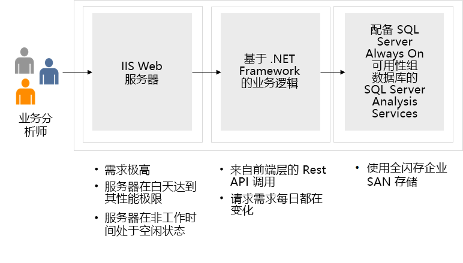

---
casestudy:
    title: '设计计算解决方案'
    module: '模块 2：设计计算解决方案'
---

# 设计计算解决方案

预计用时：90 分钟

## 要求

Tailwind Traders 希望将他们的产品目录应用程序迁移到云中。该应用程序有一个传统的 3 层配置，使用 SQL Server 作为数据存储。IT 团队希望你能帮助实现该应用程序的现代化。他们提供了这张关系图和几处可改进的方面。 

* 前端应用程序是一个基于 .NET Core 的 Web 应用。在高峰期间，每小时有 1750 名客户访问该网站。 

* 该应用程序在前端层中的 IIS Web 服务器上运行。此层级处理所有客户购买产品的请求。在最近的假日销售中，前端服务器达到了性能极限，页面加载时间很长。IT 团队已经考虑增加更多的服务器，但在非工作时间，服务器经常处于空闲状态。

* 中间层承载着处理客户请求的业务逻辑。这些请求通常是寻求支持人员的帮助。支持请求排队进行，最近等待时间很长。客户可以使用电子邮件，而不是等待服务代表。但许多客户似乎很沮丧，宁可断开连接也不愿等待。每小时有 75-125 个客户请求。 

* 后端层使用 SQL Server 数据库来存储客户订单。目前，后端数据库服务器运行良好。

* 虽然高可用性是一个问题，但由于法律要求，公司必须将所有资源放在一个区域。

## 任务

* **前端层**。你会为前端层推荐哪种 Azure 计算服务？解释一下你为什么决定采用此解决方案。 

* **中间层**。你会为中间层推荐哪种 Azure 计算服务？解释一下你为什么决定采用此解决方案。 

如何结合架构良好框架的支柱来生成高质量、稳定和高效的云体系结构？
