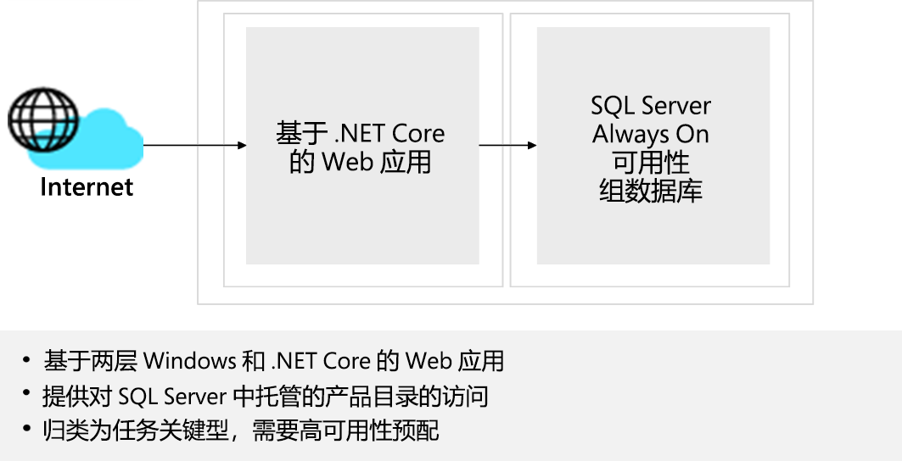

---
casestudy:
    title: '设计网络解决方案 - 产品目录企业应用程序'
    module: '网络基础结构解决方案（选项 1）'
---
# 设计网络基础结构解决方案  

预计用时：60 分钟

## 要求

由于 Tailwind Traders 企业 IT 团队准备定义将公司的一些工作负载迁移到 Azure 的策略，因此它必须确定所需的网络组件，并设计必要的网络基础结构来支持它们。考虑到该公司是在全球范围内运营的，Tailwind Traders 将使用多个 Azure 区域来托管其应用程序。其大多数应用程序都依赖于基础结构和数据服务，这些服务也将驻留在 Azure 中。迁移到 Azure 的内部应用程序必须保持能被 Tailwind Traders 用户访问的状态。迁移到 Azure 的面向 Internet 的应用程序必须保持能被任何外部客户访问的状态。 

为了将最初的网络设计结合在一起，Tailwind Traders 企业 IT 团队选择了两款关键的应用程序，它们代表了预期迁移到 Azure 的最常见的工作负载类别。  

### 设计 - 产品目录企业应用程序

- 一个面向 Internet、基于 Windows 的两层基于 .NET Core 的 Web 应用，提供对产品目录的访问，托管在 SQL Server Always On 可用性组数据库中。此应用程序被归类为任务关键型，可用性 SLA 为 99.99%，RPO 为 10 分钟，RTO 为 2 小时。 

-	业务主管强调优化客户访问面向 Internet 的应用程序时的体验的重要性，因此，将加载网页和下载静态内容所需的时间降至最低至关重要。同样，托管 Web 应用组件及其依赖项的单个服务器如果出现故障，也不应该对客户感知到的 Web 应用可用性产生太大影响。区域性故障可能会给现有的 Web 会话带来一些中断，这是大家都理解的，但应自动故障转移到灾难恢复站点。

- 为了充分利用 Azure PaaS 服务提供的优势，企业 IT 团队决定使用 Azure SQL 数据库来实现产品目录企业应用程序的数据库。 

- Tailwind Traders 信息安全与风险团队要求，属于同一个应用程序的 Azure VM 和 PaaS 服务之间的所有通信必须通过 Azure 主干网络进行，而不是通过 PaaS 服务的公共端点进行。 

## 任务 - 产品目录企业应用程序

1. 为产品目录设计一个两层网络解决方案。在适当的情况下，你的设计可以包括 Azure Front Door、WAF、Azure 防火墙和 Azure 负载均衡器。应将网络组件分组到虚拟网络中，并考虑网络安全组。准备好解释为什么选择设计的每个组件。 

如何结合架构良好框架的支柱来生成高质量、稳定和高效的云体系结构?
